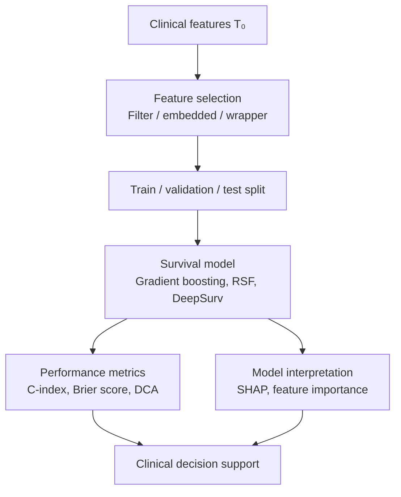
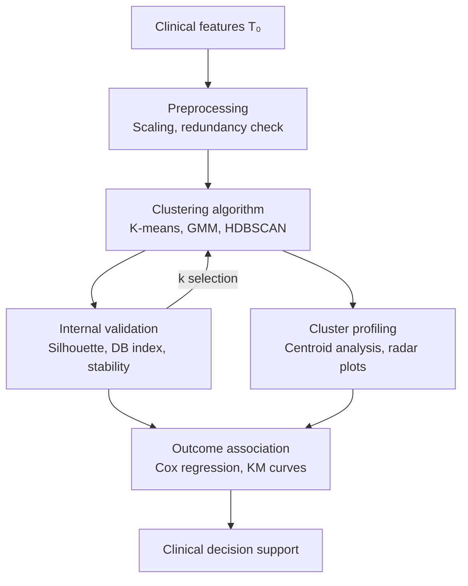

Workflow A: Supervised predictive modeling

In the supervised approach, the outcome variable (e.g., progression to cirrhosis, development of HCC, or cardiovascular event within a defined time horizon) is known a priori and serves as the training target. Feature selection precedes modeling: filter methods (univariate correlation with outcome), embedded methods (LASSO regularization, built-in importance in tree-based models), or wrapper methods (recursive feature elimination) reduce dimensionality while mitigating overfitting. Critically, feature selection must be performed exclusively within the training fold to prevent information leakage.
The modeling stage employs survival-aware algorithms — gradient boosted trees with Cox partial likelihood loss, random survival forests (RSF), or DeepSurv — which natively handle right-censored observations. Discrimination is assessed via the concordance index (C-index), calibration via predicted-vs-observed event curves, and clinical utility via decision curve analysis (DCA). Interpretability is achieved through SHAP (SHapley Additive exPlanations) values, which decompose each individual prediction into per-feature contributions, enabling clinicians to understand not only what the model predicts but why.

Workflow B: Unsupervised subtyping with outcome validation:

The unsupervised approach makes no assumptions about outcomes during subtype discovery. Preprocessing requires careful attention: features must be standardized (z-score or min-max scaling) to prevent variables with large absolute ranges from dominating cluster geometry, and redundant features (e.g., total cholesterol and LDL-C, which are algebraically related) should be identified and handled to avoid implicit weighting. The choice of clustering algorithm carries methodological implications: K-means assumes spherical, equally-sized clusters; Gaussian mixture models (GMM) accommodate elliptical cluster shapes; HDBSCAN does not require pre-specifying the number of clusters and can identify noise points. The number of clusters k is determined through internal metrics (silhouette score, Davies–Bouldin index, gap statistic) in an iterative loop, complemented by stability analysis across bootstrap resamples.
Once clusters are established, their clinical meaning is assessed in two parallel steps. Cluster profiling characterizes each subtype by its centroid values and feature distributions (e.g., via radar plots or heatmaps). Outcome association — performed strictly post hoc — tests whether identified subtypes differ in time-to-event outcomes using Kaplan–Meier analysis and multivariable Cox regression, adjusting for confounders not used in clustering.

Comparative assessment. The supervised pathway directly optimizes for outcome prediction and yields individual-level risk scores with per-feature explanations, making it immediately actionable in clinical decision-making. However, it is constrained to predicting outcomes that are pre-defined and labeled in the training data, and its performance degrades when event rates are low or follow-up is incomplete.
The unsupervised pathway discovers latent patient structure without requiring outcome labels, potentially revealing biologically meaningful subtypes that no single outcome variable would capture. Its principal limitation is that clinical relevance is not guaranteed — clusters may reflect data artifacts or confounders rather than disease biology. Furthermore, cluster assignments are sensitive to the choice of algorithm, distance metric, and feature set, necessitating rigorous stability testing and external validation.
The two approaches are complementary rather than competing. Unsupervised clustering can serve as a hypothesis-generating step, identifying candidate subtypes whose prognostic significance is subsequently tested via supervised models. Conversely, supervised feature importance (e.g., SHAP rankings) can inform feature selection for clustering, replacing ad hoc correlation-based approaches — such as the FIB-4–driven selection employed by Hong et al. — with empirically grounded dimensionality reduction. A hybrid workflow that iterates between both paradigms offers the most robust path from exploratory subtyping to validated, interpretable clinical tools.