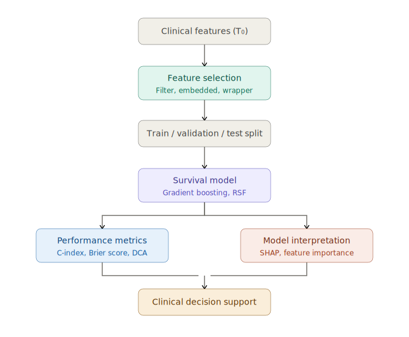
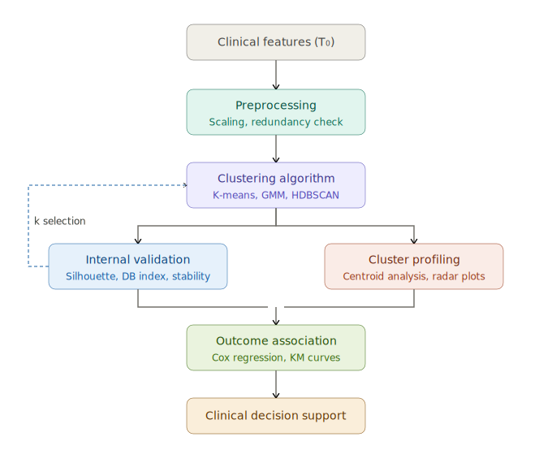

Рабочий процесс A: Предиктивное моделирование с учителем

В подходе с учителем переменная исхода (например, прогрессирование до цирроза, развитие гепатоцеллюлярной карциномы (ГЦК) или сердечно-сосудистое событие в пределах заданного временного горизонта) известна априори и используется в качестве целевой переменной для обучения. Отбор признаков предшествует моделированию: фильтрующие методы (одномерная корреляция с исходом), встроенные методы (LASSO-регуляризация, встроенная важность признаков в моделях на основе деревьев) или обёрточные методы (рекурсивное исключение признаков) снижают размерность и одновременно уменьшают переобучение. Принципиально важно, что отбор признаков должен выполняться исключительно внутри обучающей подвыборки (fold), чтобы предотвратить утечку информации.

На этапе моделирования применяются алгоритмы, учитывающие анализ выживаемости: градиентный бустинг на деревьях с функцией потерь на основе частичного правдоподобия Кокса, случайные леса выживаемости (RSF) или DeepSurv — которые нативно обрабатывают правоцензурированные наблюдения. Дискриминационная способность оценивается с помощью индекса конкордации (C-index), калибровка — с помощью кривых предсказанных и наблюдаемых событий, а клиническая полезность — с помощью анализа кривых принятия решений (DCA). Интерпретируемость обеспечивается значениями SHAP (SHapley Additive exPlanations), которые декомпозируют каждое индивидуальное предсказание на вклады отдельных признаков, позволяя клиницистам понять не только что модель предсказывает, но и почему.

Рабочий процесс B: Субтипирование без учителя с валидацией по исходам

Подход без учителя не делает никаких предположений об исходах на этапе обнаружения подтипов. Предварительная обработка требует тщательного внимания: признаки должны быть стандартизированы (z-преобразование или min-max масштабирование), чтобы переменные с большими абсолютными диапазонами не доминировали в геометрии кластеров, а избыточные признаки (например, общий холестерин и ЛПНП, которые связаны алгебраически) должны быть выявлены и обработаны для предотвращения неявного взвешивания. Выбор алгоритма кластеризации несёт методологические последствия: K-means предполагает сферические кластеры одинакового размера; модели гауссовых смесей (GMM) допускают эллиптическую форму кластеров; HDBSCAN не требует предварительного задания числа кластеров и способен выявлять шумовые точки. Число кластеров k определяется на основе внутренних метрик (коэффициент силуэта, индекс Дэвиса–Болдина, gap-статистика) в итеративном цикле, дополненном анализом устойчивости на бутстреп-выборках.

После формирования кластеров их клинический смысл оценивается в двух параллельных шагах. Профилирование кластеров характеризует каждый подтип по значениям центроидов и распределениям признаков (например, с помощью радарных диаграмм или тепловых карт). Ассоциация с исходами — выполняемая строго апостериорно — проверяет, различаются ли выявленные подтипы по показателям времени до события с использованием анализа Каплана–Мейера и многофакторной регрессии Кокса с поправкой на конфаундеры, не использовавшиеся при кластеризации.

Сравнительная оценка. Путь с учителем напрямую оптимизирует предсказание исходов и даёт индивидуальные оценки риска с объяснениями на уровне отдельных признаков, что делает его непосредственно применимым в клинической практике принятия решений. Однако он ограничен предсказанием исходов, которые заранее определены и размечены в обучающих данных, а его эффективность снижается при низкой частоте событий или неполном наблюдении.

Путь без учителя обнаруживает латентную структуру пациентов без необходимости в метках исходов, потенциально выявляя биологически значимые подтипы, которые ни одна отдельная переменная исхода не смогла бы охватить. Его основное ограничение состоит в том, что клиническая значимость не гарантирована — кластеры могут отражать артефакты данных или конфаундеры, а не биологию заболевания. Кроме того, присвоение кластеров чувствительно к выбору алгоритма, метрики расстояния и набора признаков, что требует тщательного тестирования устойчивости и внешней валидации.

Два подхода являются взаимодополняющими, а не конкурирующими. Кластеризация без учителя может служить этапом генерации гипотез, выявляя кандидатные подтипы, прогностическая значимость которых затем проверяется с помощью моделей с учителем. И наоборот, важность признаков из моделей с учителем (например, ранжирование SHAP) может направлять отбор признаков для кластеризации, заменяя эвристические подходы на основе корреляций — такие как отбор на основе FIB-4, применённый Hong et al. — эмпирически обоснованным снижением размерности. Гибридный рабочий процесс, итеративно сочетающий обе парадигмы, предлагает наиболее надёжный путь от исследовательского субтипирования к валидированным, интерпретируемым клиническим инструментам.